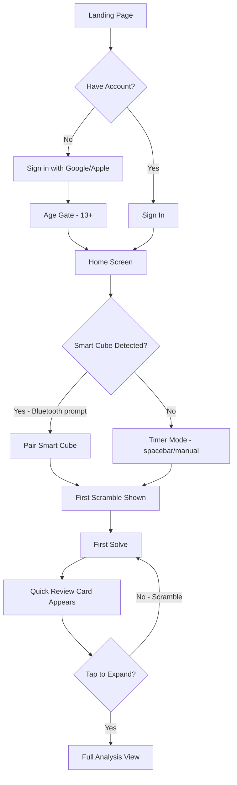
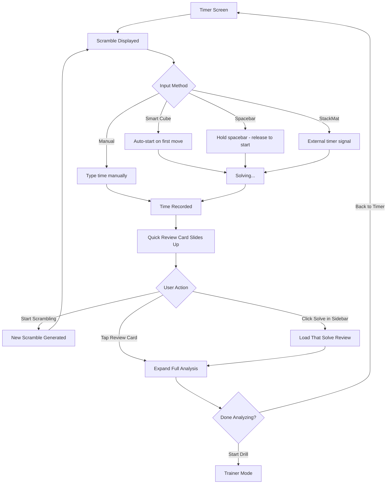
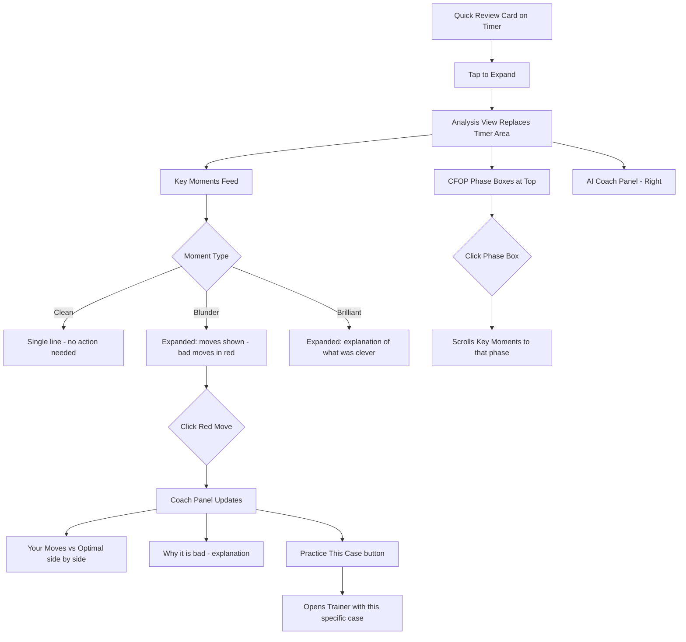
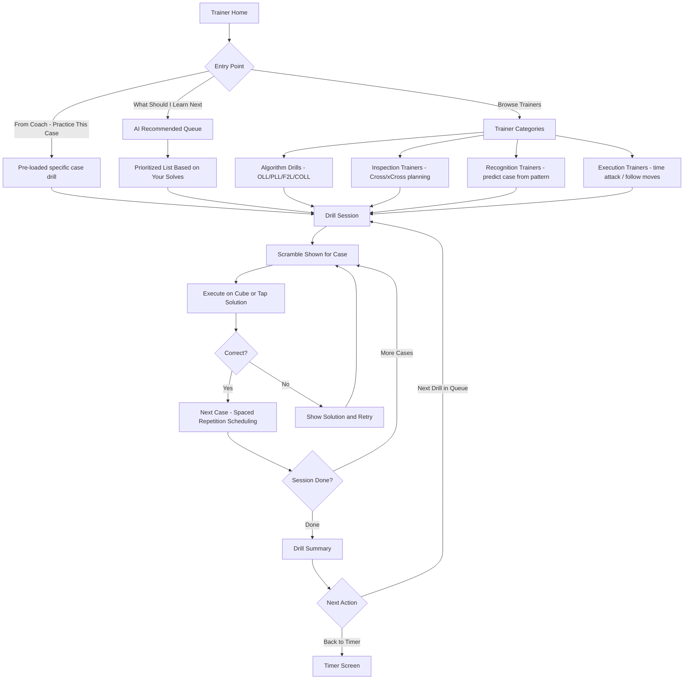
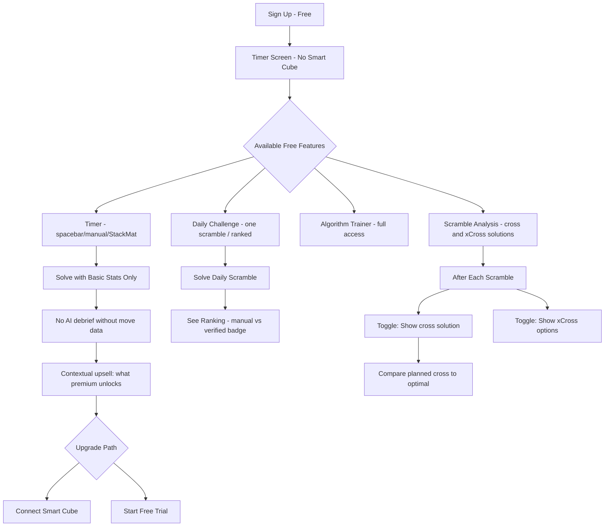

# UX Design Specification BearCube

**Author:** Sean
**Date:** 2026-02-22

---

<!-- UX design content will be appended sequentially through collaborative workflow steps -->

## Executive Summary

### Project Vision

BearCube is an AI-powered speedcubing training platform that transforms raw smart cube solve data into personalized coaching — the "chess.com for Rubik's cube." The core UX promise is: after every solve, you instantly see what you did, what was optimal, and what to practice next. The platform bridges a gap no existing tool fills: interpreting solve data into actionable improvement guidance at a fraction of the cost of human coaching.

The product is a Next.js PWA with a freemium model ($6.95/mo premium). Free tier offers a competitive timer with daily challenges, streaks, and algorithm training. Premium unlocks AI solve analysis, smart cube integration, ghost solve replay, and personalized coaching — features that require server-side compute and are structurally impossible in free client-only tools like csTimer.

### Target Users

**Primary Personas:**

| Persona | Skill Level | Age | Smart Cube | Core Need |
|---------|------------|-----|------------|-----------|
| Ethan (Intermediate Builder) | Sub-30 | 13 | Yes (MoYu) | What to learn next — guided algorithm progression |
| Maya (Plateau Grinder) | Sub-15 | 17 | Yes (GAN) | Why she's stuck — actionable F2L and recognition coaching |
| Jordan (Manual Timer) | Sub-20 | 15 | No | Free tools to improve + path to smart cube upgrade |
| Kai (Elite Optimizer) | Sub-8 | 22 | Yes (GAN) | Micro-optimizations — turning style, rotation reduction, auto-reconstruction |

**Secondary Personas:**
- **Parents** — Payment decision-makers for younger cubers. Need progress visibility, trust signals, and a professional platform.
- **First-time visitors** — Cold traffic from social media / YouTube. Need instant "aha" without sign-up friction.
- **Admin (Sean)** — Solo developer at launch. Needs system health monitoring and user management.

**Demographic UX Implications:**
- Primary age range 13-22: UI must feel modern, fast, and visually engaging — not corporate or clinical
- Mobile-first usage for casual sessions; desktop for deep analysis and ghost solve replay
- Tech-savvy audience comfortable with notation (R U R' U') but expecting zero-config setup
- Community-driven: shareability and social proof (solve cards, challenge rankings) drive adoption

### Key Design Challenges

1. **Dual-mode interface tension** — Timer mode demands absolute minimalism and millisecond precision. Analysis mode demands rich, layered data visualization. These two modes must coexist without compromise on either front, especially on mobile screens.

2. **Progressive complexity across 4 skill levels** — A sub-30 beginner and a sub-8 elite need fundamentally different depth of information. The UI must use progressive disclosure, adaptive detail levels, and potentially skill-aware defaults to serve both without overwhelming beginners or boring experts.

3. **Bluetooth connection fragility** — Web Bluetooth (Chrome/Edge only) with GAN AES encryption creates an inherently friction-prone connection flow. The UX must make connecting, reconnecting, and handling failures feel as painless as possible — and degrade gracefully for unsupported browsers/devices.

4. **Freemium boundary design** — The free tier must be genuinely useful (competitive with csTimer) to build the user base, while premium features must feel clearly worth $6.95/mo. UX must signal premium value without making the free experience feel crippled or hostile.

5. **Young user demographic with parent payers** — The interface needs to appeal to teenagers (modern, fast, visually engaging) while simultaneously building trust with parents making the payment decision (professional, safe, progress-visible).

6. **3D visualization performance** — Ghost solve replay (two synchronized 3D cubes) and real-time cube state rendering must hit 60fps across devices while keeping bundle size under 200KB gzipped.

### Design Opportunities

1. **Ghost Solve as signature UX moment** — The side-by-side 3D replay with color-coded moves is inherently viral and visually stunning. This is both the core feature and the marketing asset. Polish this interaction to perfection — it should be the 15-second video that sells the product.

2. **Zero-config onboarding as emotional hook** — No questionnaires, no setup. The app watches your first 5 solves and auto-detects your method, skill level, and algorithm set. Making this feel magical ("it already knows me") creates an immediate emotional connection no competitor offers.

3. **Micro-progress visibility engine** — PR celebrations, phase-specific improvements, and "fastest cross this week" moments surface progress cubers can't see themselves. This directly combats plateau frustration — the #1 reason cubers stop improving — and drives retention.

4. **Instant debrief → deep analysis flow** — The 2-line post-solve insight in timer view that expands to full analysis, ghost solve, and drill recommendations creates a tight, addictive feedback loop. The UX challenge is making the transition from "quick glance" to "deep dive" seamless and inviting.

5. **Shareable solve cards as organic growth** — Post-solve summary cards, daily challenge rankings, and ghost solve clips are designed to be shared on Discord, Reddit, and social media. Every shared asset is free marketing with built-in product demonstration.

## Core User Experience

### Defining Experience

**The Core Loop: Solve → Learn → Improve → Repeat**

BearCube's defining experience is the tight feedback cycle between solving and learning. Every solve — whether via smart cube, spacebar timer, external timer, or manual entry — feeds into a system that finds the signal in the noise and tells you what matters.

**The core interaction hierarchy:**

1. **Solve** — Multiple input methods, all first-class citizens:
   - Smart cube auto-detection (timer starts on first move, no manual trigger needed)
   - Spacebar hold-to-start (csTimer convention, expected by every cuber)
   - External timer (StackMat) connection
   - Manual time entry for importing or quick logging
2. **Instant per-solve debrief** — Immediately after each solve, a compact breakdown appears: time, phase splits, efficiency highlights, and the single most actionable insight from that solve
3. **Session-level analysis** — Across the full practice session, aggregated patterns emerge: average phase splits, consistency trends, whether that one bad solve was a fluke or a pattern. Session context often tells a more useful story than any individual solve
4. **Targeted practice** — Based on both per-solve and session data, recommended drills and algorithm training that address the real bottlenecks

**The critical interaction to get right:** The post-solve moment. The 2-3 seconds after a solve completes must feel instant and insightful — not a loading screen, not a wall of data, but a clean, glanceable debrief that earns the right to be there between rapid-fire solves.

### Platform Strategy

**Desktop-first development, mobile-first design philosophy.**

- Build and test primarily on desktop, but design layouts mobile-first so the experience translates naturally to smaller screens
- Timer view must work flawlessly on mobile (phone sitting next to cube on desk is a primary use context)
- Analysis and ghost solve replay are richer experiences on desktop/tablet but must be functional and navigable on mobile
- PWA installation for app-like experience on both platforms

**Input method matrix:**

| Input Method | Timer Control | Move Data | AI Analysis | Availability |
|-------------|--------------|-----------|-------------|-------------|
| Smart cube (BLE) | Auto-start on first move | Full move sequence + timestamps | Full AI solve review, ghost solve, phase detection | Premium (Chrome/Edge) |
| Spacebar timer | Manual start/stop | None | Time-only statistics | All users, all browsers |
| External timer (StackMat) | Hardware signal | None | Time-only statistics | All users (Chrome/Edge) |
| Manual entry | N/A (enter time) | None | Time-only statistics | All users, all browsers |

**Browser strategy:** Non-smart-cube features work everywhere. Smart cube features show clear, friendly messaging on unsupported browsers directing to Chrome/Edge — never a broken or confusing state.

### Effortless Interactions

**What should feel completely automatic:**

- **Smart cube connection** — One-click connect, auto-reconnect on drop, remember last device. The cube should feel like it "just works" once paired.
- **Solve detection** — Smart cube auto-starts timer on first move, auto-stops when solved. No manual intervention. The cube IS the controller.
- **Method and skill detection** — First 5 solves build the cuber profile silently. No questionnaires, no "select your skill level" dropdown. The AI observes and adapts.
- **Session management** — Sessions flow naturally. No "start session" / "end session" buttons. Solve, see debrief, solve again. Session boundaries are implied by time gaps.
- **Scramble progression** — Next scramble ready before you finish reading the debrief. Never waiting.

**Where competitors create friction that BearCube eliminates:**

- csTimer: No interpretation of data — you get numbers, you figure out what they mean
- Cubeast: Smart cube analytics without actionable coaching — "your F2L is 7.5s" but not "here's why and what to change"
- CubeStation: GAN-locked, buggy connections, Chinese-language dialogs mid-session
- All tools: Require manual algorithm set input or ignore it entirely — BearCube learns your algorithms by watching you solve

### Critical Success Moments

**1. First Smart Cube Solve (The "Aha" Moment)**
The user connects their smart cube, does one solve, and within 2-3 seconds sees something no other tool has ever shown them: a phase-by-phase breakdown with efficiency scores and a specific, actionable insight. This is the moment that converts "trying it out" into "I need this."

**2. Ghost Solve Replay (The "Show Everyone" Moment)**
First time watching their solve play side-by-side against optimal — color-coded moves making the divergence visually obvious. This is the moment users screenshot, screen-record, and share. The viral marketing asset.

**3. Session Pattern Recognition (The "It Gets Me" Moment)**
After a practice session of 10-20 solves, the session summary reveals a pattern they couldn't see: "Your F2L pair 3 averaged 2 extra moves across 15 solves — here's the insertion you keep missing." The AI coach proving its value with data they can't get anywhere else.

**4. First Measurable Improvement (The "It's Working" Moment)**
Whether it's an Ao100 drop, a phase-specific improvement, or learning a new algorithm the app recommended — the first time the user sees data-backed proof that BearCube's coaching made them faster. This is what converts free trials to paid subscriptions.

**5. No-Auth First Touch (The "Low Commitment" Moment)**
A visitor arrives from social media or a YouTube link. They can try features — daily challenge, explore the timer, see what the app offers — without creating an account. The barrier to first value is zero. Sign-up happens when they're already engaged, not as a gate.

### Experience Principles

1. **Solve-first, analyze-second** — The timer is sacred. Nothing interrupts or slows down the solving experience. Analysis is always available but never forced. During rapid-fire sessions, the debrief is glanceable; deep dives happen when the cuber is ready.

2. **Show, don't tell** — Use visual language whenever possible. Color-coded moves, phase breakdown bars, ghost solve animations, and efficiency scores communicate faster than paragraphs. A cuber should understand their solve quality in a 1-second glance.

3. **Earn the right to be complex** — Start simple. Show more as the cuber engages deeper. A sub-30 beginner sees "your cross used too many moves." A sub-8 elite sees per-move TPS analysis, rotation counts, and lookahead gaps. Same data, skill-appropriate presentation.

4. **Every solve teaches something** — Whether it's a PB or a bad solve, BearCube finds something useful. In a session context, even "bad" solves contribute to pattern recognition. The app never makes you feel like a solve was wasted.

5. **Zero-friction, maximum flexibility** — Four input methods, no mandatory setup, no required sign-up for first value, sessions that flow naturally. Meet cubers where they are — don't make them adapt to the tool.

## Desired Emotional Response

### Primary Emotional Goals

**1. Clarity — "I see it now"**
The defining emotional response of BearCube. Every solve produces a moment of understanding — where time was lost, what was efficient, what to change. Not overwhelming data, but focused insight. The feeling of fog lifting. This is what no other cubing tool delivers and what makes users say "I can't go back to just a timer."

**2. Agency — "I know exactly what to work on"**
The opposite of plateau helplessness. BearCube replaces "I'm stuck and don't know why" with "I have a specific plan." The AI coach doesn't just diagnose — it prescribes. Users should feel empowered and directed, never lost.

**3. Momentum — "I'm getting better, solve by solve"**
The compounding feeling of progress, visible even in small increments. Micro-PRs, phase improvements, algorithm mastery milestones. The emotional reward that makes cubers open the app daily — not because of streaks or gamification tricks, but because they genuinely feel the trajectory.

**4. Trust — "This app knows what it's talking about"**
The AI coach must earn credibility quickly. Correct solutions, accurate phase detection, insights that match what the cuber experiences. One wrong analysis or nonsensical recommendation destroys trust in a niche community where expertise matters. The tone is authoritative and precise — a coach who's done their homework.

### Emotional Journey Mapping

| Stage | Desired Emotion | Design Implication |
|-------|----------------|-------------------|
| **First visit (no auth)** | Curiosity, low-stakes interest | Features available without sign-up. Clean landing. No pressure. "Try this." |
| **First solve** | Surprise, intrigue | Instant debrief shows something they've never seen from a timer. "Wait, it can do that?" |
| **First AI analysis** | Clarity, excitement | Phase breakdown with color-coded efficiency. The "I see it" moment. Visual, immediate, specific. |
| **Ghost solve replay** | Awe, desire to share | Side-by-side 3D replay is the emotional peak. Visually stunning. The "show everyone" moment. |
| **Session review** | Understanding, direction | Session patterns reveal what individual solves can't. "Now I know what to practice." Feels like a coaching session. |
| **Bad solve** | Neutral acceptance | Data presented the same way as any solve. Still highlights what went well, what didn't. No judgment, no sugar-coating. Just facts. |
| **Plateau period** | Quiet confidence | Micro-progress still visible: "Your OLL recognition improved 0.2s this week." Phase-specific gains even when Ao100 is flat. |
| **Measurable improvement** | Earned pride | PR celebrations that feel genuine, not gamified. Data-backed proof: "Your Ao100 dropped 1.3s since you started targeting F2L pair 3." |
| **Returning daily** | Purposeful habit | Not "maintain your streak!" guilt. Instead: "Here's what's next in your training." The pull is curiosity about your own improvement. |

### Micro-Emotions

**Emotions to cultivate:**

- **Confidence** — "I understand my own solving now." The cuber profile, knowledge map, and phase data build self-awareness that translates to confidence on every solve
- **Curiosity** — "What will the next solve reveal?" The debrief after each solve creates a pull toward the next one. Not gamification-driven, but insight-driven
- **Ownership** — "This is MY cubing data, MY profile, MY improvement trajectory." The compounding cuber profile creates personal investment that makes switching costly
- **Respect** — "This tool takes cubing seriously." Professional-quality analysis, correct terminology (R U R' U', not "turn the right side"), precise data. Built by someone who understands the craft

**Emotions to avoid:**

- **Shame** — Never make a cuber feel bad about their level. A sub-30 solve gets the same quality analysis as a sub-8 solve. Efficiency scores are relative to the user's own trajectory, not absolute judgment
- **Overwhelm** — Progressive disclosure prevents data overload. The sub-30 beginner sees 3 insights; the sub-8 elite can drill into 15 metrics. Never dump everything at once
- **Guilt** — No "you broke your streak!" notifications. No "you haven't practiced in 3 days!" nagging. The app is a tool that's ready when you are, not a demanding obligation
- **Distrust** — One incorrect AI analysis or wrong solution poisons the well. Accuracy is non-negotiable. When confidence is low on an analysis, say so — "Limited data for this case" is better than a wrong recommendation

### Design Implications

| Emotional Goal | UX Design Approach |
|---------------|-------------------|
| **Clarity** | Color-coded efficiency (green/yellow/orange/red), phase breakdown bars, single most-actionable insight highlighted per solve. Visual hierarchy that guides the eye to what matters most |
| **Agency** | "What to practice next" always visible. Training recommendations ranked by impact. Goal-setting with concrete roadmap: "To reach sub-15, focus on these 3 things" |
| **Momentum** | PR celebration engine that finds micro-progress (fastest cross this week, cleanest F2L session ever). Progress charts that show trajectory, not just current state. Weekly summaries that quantify improvement |
| **Trust** | Precise cubing terminology throughout. Transparent scoring (show sub-scores and weights, not black-box numbers). Correct AI solutions verified against known-good solvers. Honest about limitations |
| **Neutral on bad solves** | Same data layout regardless of solve quality. No sad faces, no red warnings, no "you did worse than usual." Phase breakdown still shows what went well alongside what didn't. Session context normalizes individual variance |
| **Coach voice, not cheerleader** | Direct, data-backed language. "Your F2L pair 2 averaged 4.2 moves — optimal is 3.1. Here's the insertion." Not "Great job! You're doing amazing!" Respect the cuber's intelligence |

### Emotional Design Principles

1. **Data is the emotion** — Let the numbers and visuals create the feeling. A 94% efficiency score feels good without needing a "Great solve!" label. A color-coded timeline where most moves are green speaks for itself. Trust the cuber to read the data.

2. **Coach, not cheerleader** — The AI voice is knowledgeable, direct, and respectful. It speaks like a coach who's studied your film: "Here's what I see, here's what to change, here's how to practice it." Never condescending, never over-enthusiastic. Authoritative and earned.

3. **Neutral ground for every solve** — Bad solves get the same analytical treatment as great ones. The AI still finds useful data in a bad solve ("despite the F2L fumble, your OLL recognition was your fastest this session"). No judgment — just signal.

4. **Progress is always visible** — Even during plateaus, the system surfaces micro-improvements. The emotional design ensures a cuber never opens the app and feels like nothing is happening. Phase-specific gains, consistency improvements, and algorithm mastery milestones keep the momentum feeling alive.

5. **Respect the craft** — Use correct cubing notation, proper terminology, and precise metrics. The emotional tone says "this was built by someone who cubes" — not a generic productivity app wearing a cube skin. Every detail signals domain expertise.

## UX Pattern Analysis & Inspiration

### Inspiring Products Analysis

**Chess.com — The AI Review Model**

Chess.com's post-game review is the direct UX blueprint for BearCube's AI solve analysis. Key patterns:
- **Accuracy score (0-100%)** after every game — instantly communicates performance quality in one number
- **Move-by-move color coding** (brilliant/great/good/inaccuracy/mistake/blunder) — makes analysis visual and immediate without reading paragraphs
- **"What you should have played"** for each move — the actionable coaching moment that keeps players coming back
- **Game review is the gateway drug** — free users get limited reviews, premium gets unlimited. The review itself sells the subscription
- **Emotional neutrality** — the analysis doesn't say "bad game!" It shows you what happened and what to improve. The data speaks

**Transferable to BearCube:** The entire post-solve review flow — efficiency score, color-coded moves, "here's what optimal looked like," and gating full analysis behind premium. Chess.com proved this model creates retention AND revenue.

**Duolingo — The Retention Engine**

Duolingo's UX genius is making daily practice feel lightweight and rewarding:
- **5-minute sessions** — low commitment threshold means people start when they wouldn't otherwise
- **Streaks** — controversial but effective for habit formation. The key is they don't punish; they celebrate
- **Progressive difficulty** — adapts to your level silently, never overwhelming
- **Immediate feedback** — right/wrong on every answer, no waiting for end-of-session results

**Transferable to BearCube:** Bite-sized training drills ("5-minute OLL drill"), streak mechanics (celebrate, don't guilt), zero-config skill detection, and the tight feedback loop of learning something every session. Duolingo's onboarding flow — where the first lesson happens before sign-up — directly maps to BearCube's no-auth first touch.

**Strava — The Quantified Self**

Strava turned solo exercise into a data-rich, shareable experience:
- **Every activity automatically analyzed** — pace, splits, heart rate zones, effort score. The workout itself becomes content
- **Personal records surfaced automatically** — "fastest 5K this month," "longest ride ever." Micro-PRs that keep athletes engaged during plateaus
- **Shareable activity cards** — beautiful summary images posted to social media. Every share is free marketing
- **Relative effort scoring** — your performance contextualized against your own history, not absolute standards

**Transferable to BearCube:** Post-solve summary cards (shareable), automatic PR detection across micro-categories, session-level analysis (like Strava's weekly training summary), and the principle of making every solve feel like an "activity" worth logging.

### Cubing Tool UX Analysis

**csTimer — The Incumbent**

| Strength to Learn From | Weakness to Exploit |
|------------------------|-------------------|
| Extreme customization — users can tailor every stat, display, and behavior | UI is utilitarian and dated — functional but not inviting |
| Spacebar-hold convention is universal — every cuber expects this | No interpretation of data — shows numbers, expects user to self-diagnose |
| Session management is flexible | Information density can overwhelm newcomers |
| Feature depth is unmatched for a free tool | No personality — feels like a spreadsheet, not a training partner |

**Design lesson:** Match csTimer's timer precision and spacebar convention. Beat it on visual design, data interpretation, and personality. Don't try to out-feature csTimer on customization — out-interpret it on coaching.

**Cubeast — The Direct Competitor**

| Strength to Learn From | Weakness to Exploit |
|------------------------|-------------------|
| Clean, modern web UI — the best-looking cubing tool | Shows data without interpretation — "your F2L is 7.5s" but not what to change |
| Recognition vs. execution time separation — genuinely useful metric | No AI comparison to optimal — this is the gap BearCube fills |
| Universal smart cube support | Limited coaching or actionable recommendations |
| Pickup/putdown time tracking — attention to detail | No ghost solve or visual comparison tools |

**Design lesson:** Cubeast's visual quality is the minimum bar. BearCube must match its polish AND add the interpretation layer. Every metric Cubeast shows as a number, BearCube should show with context and action.

**CubeStation — The Visual Reference**

| Strength to Learn From | Weakness to Exploit |
|------------------------|-------------------|
| Polished visual design — feels premium | GAN-locked — only works with one brand |
| CFOP auto-segmentation with sub-phases | Buggy connections, unreliable experience |
| F2L breakdown into observation/execution/adjustment | Chinese-language dialogs break immersion for English users |
| Solution optimization suggestions | No personality — technically capable but emotionally flat |

**Design lesson:** CubeStation proves that polished visual design works in cubing tools — users respond to it. But polish without reliability is worse than ugly-but-stable (csTimer). BearCube needs both: CubeStation's visual ambition with csTimer's reliability.

### Transferable UX Patterns

**Navigation Patterns:**

- **Tab-based primary navigation** (Timer / Analysis / Training / Profile) — csTimer uses tabs, chess.com uses tabs, Strava uses tabs. Proven pattern for multi-mode apps. Timer tab is always one tap away
- **Expandable detail cards** — solve debrief starts compact (2-line summary), expands to full analysis on tap. Chess.com's game summary → full review flow. Prevents overwhelm while keeping depth accessible
- **Contextual side panels (desktop)** — on wider screens, analysis appears alongside timer without page navigation. Solve list + details pattern like email clients

**Interaction Patterns:**

- **Instant feedback after every action** — Duolingo's right/wrong, chess.com's accuracy, Strava's splits. BearCube's post-solve debrief follows this same principle: every solve gets a response
- **Progressive disclosure by engagement depth** — summary → details → deep dive. Never dump everything. Let curiosity drive exploration
- **Swipe between solves** — mobile pattern for navigating solve history. Left/right through recent solves, each showing its debrief card

**Visual Patterns:**

- **Color as primary data language** — green/yellow/orange/red efficiency grading (chess.com precedent). Cubers should read their solve quality in colors before reading numbers
- **Phase breakdown bars** — horizontal stacked bars showing time or move distribution across Cross/F2L/OLL/PLL. Instant visual of where time went
- **Sparkline trends** — small inline charts showing Ao5/Ao12 trajectory. Strava uses these for pace trends. Communicates direction without taking space

### Anti-Patterns to Avoid

1. **The csTimer trap: feature density without hierarchy** — csTimer has everything but new users can't find anything. BearCube must be opinionated about what matters most at each skill level, not just offer every option

2. **The "wall of settings" onboarding** — CubeStation and many cubing apps ask for method, skill level, cube type before you can start. BearCube's zero-config approach (learn from first 5 solves) eliminates this friction entirely

3. **Generic gamification** — XP points, arbitrary badges, "Level 7 Cuber!" labels that mean nothing. If BearCube has achievements, they must map to real cubing milestones ("All 21 PLL cases learned," "First sub-15 Ao5") not engagement theatre

4. **Black-box AI scores** — "Your solve score is 73%" without explaining why. Chess.com shows sub-scores and explains each. BearCube must be transparent: show the phase sub-scores, the weights, what drove the number. Trust is built through transparency

5. **Guilt-driven retention** — Duolingo's aggressive streak notifications cross the line. BearCube should celebrate streaks when you're there, not punish when you're not. The app waits for you, it doesn't chase you

6. **Desktop-only analysis views** — Cubeast's analysis works on desktop but can feel cramped on mobile. Every BearCube analysis view must be mobile-first, then enhanced on desktop — not the other way around

### Design Inspiration Strategy

**Adopt directly:**
- Chess.com's post-game review flow → BearCube's post-solve AI analysis (efficiency score, color-coded moves, "what optimal looked like")
- Strava's automatic PR detection → BearCube's micro-progress celebrations across granular categories
- Duolingo's no-auth first experience → BearCube's features-before-signup approach
- Tab-based navigation with timer always one tap away

**Adapt for cubing:**
- Chess.com's accuracy score → BearCube's efficiency score (weighted by phase, transparent sub-scores)
- Strava's shareable activity cards → BearCube's post-solve summary cards (cubing-specific: scramble, time, phase splits, efficiency)
- Duolingo's bite-sized lessons → BearCube's "5-minute drill" sessions targeting specific weaknesses
- Duolingo's progressive difficulty → BearCube's skill-aware detail levels (progressive disclosure by cuber level)

**Create uniquely for BearCube:**
- Ghost solve replay — no analog exists in any domain. Side-by-side 3D visualization is BearCube's signature UX moment
- Session-level coaching insights — aggregated patterns across a practice session that reveal what individual solves can't
- Algorithm knowledge map — visual representation of "what you know" that builds over time
- The coach personality — direct, data-backed, respectful. Not a generic AI, not a cheerleader. A knowledgeable cubing coach

**Avoid:**
- csTimer's feature-everything-show-everything approach — be opinionated, not exhaustive
- CubeStation's visual polish without reliability — never sacrifice stability for aesthetics
- Duolingo's guilt mechanics — celebrate presence, don't punish absence
- Black-box scoring — always show your work

## Design System Foundation

### Design System Choice

**Ant Design (antd) v5 + CSS-in-JS**

BearCube will use Ant Design v5 as the component library foundation with its built-in CSS-in-JS styling system (`@ant-design/cssinjs`). No Tailwind CSS. No CSS modules. All styling through Ant Design's Design Token system and CSS-in-JS for custom components.

### Rationale for Selection

**Why Ant Design:**

1. **Rich data display components** — BearCube is fundamentally a data-heavy application. Solve lists, phase breakdowns, statistics tables, cuber profiles, algorithm knowledge maps, and session analytics all benefit from Ant Design's mature Table, Statistic, Card, Descriptions, Progress, Tabs, and Tag components
2. **Developer preference and experience** — Sean has enjoyed working with Ant Design previously. For a solo project, developer happiness and familiarity directly translate to velocity and code quality
3. **Comprehensive out-of-the-box** — Form handling, modals, drawers, notifications, dropdowns, segmented controls, and layout components reduce the amount of custom UI work, freeing time for BearCube's unique custom components (timer, 3D cube, ghost solve)
4. **CSS-in-JS by default** — Ant Design v5 uses CSS-in-JS natively, matching the project's preferred styling approach. No separate CSS module files, no Tailwind utility classes — styling lives with components
5. **Design Token theming** — v5's token-based system (seed tokens, map tokens, component tokens) enables deep visual customization while maintaining consistency. Dark mode is a first-class citizen via `theme.darkAlgorithm`
6. **Charts ecosystem** — `@ant-design/charts` (built on G2/AntV) provides data visualization for progress charts, session analytics, and sparkline trends without adding a separate charting library
7. **Tree-shaking in v5** — Import only what you use. Bundle impact is manageable with selective imports

### Implementation Approach

**Theme Configuration:**

The default Ant Design aesthetic skews enterprise/corporate. BearCube needs intentional theming to feel modern, energetic, and appropriate for a 13-22 year old cubing audience:

- **Dark mode as default** — cubers practice in bedrooms, often at night. Dark theme is the natural choice and matches csTimer/Cubeast conventions. Light mode available as option
- **Custom color palette** — move away from Ant Design's default blue. BearCube needs an energetic, distinctive primary color that works in dark mode and complements the green/yellow/orange/red efficiency grading system
- **Border radius** — increase from Ant Design defaults for a softer, more modern feel
- **Typography** — select a font that feels contemporary and readable at both large timer displays and small data labels
- **Spacing and density** — tighter than default Ant Design for data-dense views (solve lists, statistics), more generous for focus views (timer, ghost solve)

**Component Strategy:**

| Component Type | Approach |
|---------------|----------|
| **Standard UI** (navigation, cards, tables, forms, modals) | Ant Design components with Design Token theming |
| **Timer display** | Fully custom — large, precise, minimal. No Ant Design components in the sacred timer space |
| **3D cube visualization** | Fully custom — Three.js / React Three Fiber. Independent of design system |
| **Ghost solve replay** | Fully custom — synchronized 3D animation with custom controls |
| **Phase breakdown bars** | Custom component using CSS-in-JS, following Ant Design token colors for consistency |
| **Color-coded move grading** | Custom component — green/yellow/orange/red system with colorblind-safe shape indicators |
| **Efficiency score display** | Custom component with Ant Design Progress/Statistic as base, heavily styled |
| **Solve debrief card** | Hybrid — Ant Design Card shell with custom interior layout |
| **Algorithm knowledge map** | Custom visualization, may use @ant-design/charts for grid/heatmap |
| **Shareable solve cards** | Custom — canvas-rendered for image export, styled independently |

### Customization Strategy

**Design Token Layers:**

1. **Seed tokens** — Primary color, border radius, font family. These cascade through the entire system
2. **Map tokens** — Dark mode algorithm applied globally. Adjust surface colors, text colors, border colors for the BearCube dark theme
3. **Component tokens** — Per-component overrides where Ant Design defaults don't match BearCube's personality (e.g., Tab styling, Card shadows, Table density)
4. **CSS-in-JS custom components** — All BearCube-specific components styled using the same CSS-in-JS approach, consuming Design Tokens for color/spacing consistency

**Key Theming Decisions (to be refined in visual design step):**

- Dark background with subtle surface elevation for depth
- Accent color that stands out in dark mode without clashing with efficiency grading colors
- Monospace font for timer display, move notation, and scramble text
- Sans-serif for UI text, labels, and coaching insights
- Consistent use of Ant Design's spacing scale for all custom components
- Motion/animation tokens for transitions — snappy, not sluggish

## Defining User Experience

### The Defining Experience

**"BearCube is your pocket cubing coach."**

That's the one-sentence description users tell their friends. Not "it shows you optimal solutions" or "it tracks your times" — it's a coach that watches you solve and tells you how to improve.

**The famous-product parallel:**

- Tinder: "Swipe to match with people"
- Duolingo: "Learn a language in 5 minutes a day"
- **BearCube: "A pocket coach that makes you faster after every solve"**

The defining interaction is not the timer. It's not the ghost solve. It's the moment after a solve when your pocket coach says: "Your cross was clean, but you're losing time on F2L pair 3 — here's the insertion you keep fumbling." That personalized, actionable, immediate coaching moment is what makes BearCube irreplaceable.

### User Mental Model

**How cubers currently improve:**

| Current Approach | Mental Model | Limitation |
|-----------------|-------------|------------|
| Self-analysis after solves | "I'll watch my hands and figure out what's slow" | Humans can't accurately self-diagnose at speed. Bias toward noticing dramatic errors, missing systematic inefficiencies |
| YouTube tutorials | "I'll learn new algorithms and techniques" | Generic advice, not personalized. Doesn't know which algorithms you already use or where your specific weaknesses are |
| csTimer statistics | "I'll track my times and look for trends" | Numbers without interpretation. Shows Ao5 dropped but not WHY or what changed |
| Human coaching | "A coach watches me solve and tells me what to fix" | Expensive ($30-80/hr), limited availability, inconsistent quality |
| Cubeast analytics | "I'll look at my phase splits and recognition times" | Data without coaching. "Your F2L is 7.5s" but not "here's why and here's the drill" |

**BearCube's mental model shift:**

Users should think of BearCube the way they think of a personal coach — not a tool they operate, but a knowledgeable partner that watches, understands, and advises. The key difference from existing tools:

- **csTimer** = calculator (you do the math, you interpret)
- **Cubeast** = dashboard (data displayed, you figure it out)
- **BearCube** = coach (watches you, understands your patterns, tells you what to work on)

**Where users might get confused:**
- Expecting BearCube to be "just another timer" — the coaching value needs to surface immediately in the first solve
- Not understanding why smart cube features require Chrome/Edge — clear browser messaging before frustration
- Expecting the AI to be always right — honest confidence levels ("limited data for this case") build more trust than false certainty

### Success Criteria

**What makes users say "this just works":**

1. **Instant** — Coach feedback appears within 2-3 seconds of solving. No loading screens, no "processing..." delays. The debrief feels like it was already waiting
2. **Personally relevant** — The insight is about YOUR solve, YOUR patterns, YOUR skill level. Not generic advice. The sub-30 beginner gets "your cross averaged 8 moves — aim for under 6." The sub-10 expert gets "you're rotating into F2L pair 2 — this angle eliminates the rotation"
3. **Actionable** — Every coaching insight has a clear next step. Not "your F2L is slow" but "practice this specific insertion for F2L pair 3 — here's a drill." The coach always answers "what should I do about it?"
4. **Trustworthy** — The AI's solutions are verifiable against known-good solvers. Phase detection matches what the cuber experienced. Efficiency scores are transparent (show sub-scores, not just a number). When confidence is low, it says so
5. **Non-intrusive** — During rapid-fire solving, the coaching insight is a glanceable 2-line summary. It doesn't demand attention. It earns attention by being consistently useful. Deep analysis is always one tap away but never forced
6. **Cumulative** — The coach gets better as it learns more about you. Session 1 gives generic phase-level feedback. Session 10 knows your algorithm set. Session 50 understands your turning style tendencies. The relationship deepens over time

### Novel UX Patterns

**Pattern Analysis:**

BearCube's core experience combines familiar patterns in a novel way — no single element is unprecedented, but the combination is unique in the cubing space.

**Established patterns BearCube adopts:**
- Post-action review with color-coded grading (chess.com precedent — proven, understood by users)
- Efficiency/accuracy scoring on a 0-100% scale (universally understood metric)
- Progressive disclosure from summary to detail (standard mobile UX)
- Streak and milestone celebrations (Duolingo/fitness app convention)
- Tab-based navigation between modes (universal mobile pattern)

**Novel patterns BearCube introduces to cubing:**
- **AI coaching voice** — No cubing tool has a "coach personality" that speaks directly to the user with actionable advice. This is chess.com's game review fused with a coaching tone
- **Ghost solve replay** — Side-by-side 3D solve comparison has no direct analog in any domain. The closest parallel is sports video analysis overlays, adapted to a 3D interactive context
- **Algorithm fingerprinting from solve data** — Auto-detecting which algorithms a user knows by watching them solve is genuinely novel. No setup, no questionnaires — the AI learns by observing
- **Session-level coaching synthesis** — Aggregating patterns across a full practice session to reveal what individual solves can't show. Moves cubing analysis from "solve-by-solve" to "session coaching"

**Teaching new patterns:**
- Ghost solve replay: Use familiar video player controls (play/pause/speed/scrub) applied to 3D context. The metaphor is "watching film" — athletes understand this immediately
- Algorithm fingerprinting: No user education needed — it happens invisibly. The user simply notices that the app "already knows" their algorithms
- Coach voice: Frame it as the AI observing, not computing. "I noticed..." and "Looking at your session..." feel natural and human

### Experience Mechanics

**The Pocket Coach Loop:**

**1. Initiation — Starting a Solve**

- **Smart cube**: Pick up cube, make first move. Timer starts automatically. No button press, no trigger. The cube IS the input device
- **Spacebar**: Hold spacebar, release to start. csTimer convention — every cuber's muscle memory
- **External timer**: StackMat signal starts the clock. Hardware-native feel
- **Manual entry**: Type the time. Simplest possible input for logging

The initiation must feel invisible. Zero friction between "I want to solve" and solving. Scramble is already displayed. Timer is ready. The app is waiting for you, not the other way around.

**2. Interaction — The Solve Itself**

- **Timer view is sacred**: Large, precise time display. Minimal UI. Nothing distracts. The timer owns the screen
- **Smart cube: real-time state** (optional, configurable): Show cube state updating live during the solve. Some cubers find this motivating; others find it distracting. Default off, easily toggled
- **No interruptions**: No notifications, no popups, no coaching during the solve. The app is silent and watching. Analysis happens after, never during

**3. Feedback — The Pocket Coach Moment**

This is the defining interaction. Within 2-3 seconds of solve completion:

- **Compact debrief card** slides in below the timer (or replaces the scramble area):
  - Time + delta from session average
  - Phase split bar (Cross | F2L | OLL | PLL) with color-coded efficiency
  - **The coach line**: One sentence of personalized insight. "Clean cross, but F2L pair 3 cost you 1.8s — you used 11 moves where 7 was optimal"
  - Tap to expand for full analysis, ghost solve, drill recommendation

- **For non-smart-cube solves** (spacebar/external/manual):
  - Time + delta from session average
  - Session trend sparkline (Ao5/Ao12)
  - **The coach line**: Based on time-only patterns. "Your last 5 solves averaged 18.2s — that's 0.8s faster than your session start. Consistency is improving"

- **Session context is always present**: Running Ao5, Ao12, session best, session average visible at a glance. The individual solve exists within the session narrative

**4. Completion — Session Wrap-Up**

When the cuber is done (long pause, navigates away, or explicitly ends session):

- **Session summary card**:
  - Solve count, session duration
  - Session average, best, worst (with those solves expandable)
  - Phase-by-phase session trends (where did time go across all solves?)
  - **Session coaching insight**: The big-picture pattern. "Across 15 solves, your F2L pair 3 was consistently your weakest — 2.1 moves above optimal on average. This is your highest-impact training target"
  - Recommended drill based on session data

- **No forced session boundaries**: If the cuber keeps solving, the session just grows. "End session" is never required. Natural pauses create soft boundaries

**5. Growth — The Cumulative Coach**

Over time, the pocket coach builds a deeper understanding:

- **Cuber profile evolves**: Algorithm knowledge map fills in, turning style tendencies tracked, phase-specific strengths and weaknesses sharpened with more data
- **Coaching gets more specific**: Session 1 says "your F2L is slow." Session 20 says "you're using a 9-move insertion for F2L case #31 — here's the 6-move version you should learn next"
- **Progress made visible**: Weekly/monthly trends, PR timelines, algorithm mastery progression. The cuber can see their own growth trajectory in data
- **Training recommendations compound**: Each session's data feeds into smarter, more targeted practice suggestions. The coach doesn't repeat itself — it evolves with you

## Visual Design Foundation

### Color System

**Palette: "Honey Bear" — Teal Primary + Warm Amber Brand Accent**

The color system uses teal as the interactive primary (buttons, links, focus rings, active states) and warm amber as the brand accent (logo, PR celebrations, premium badge, marketing moments). Warm-tinted dark surfaces create a subtle bear-den warmth distinct from generic dark UIs. Primary color (teal) is subject to change during implementation if it doesn't feel right in context.

**Primary / Interactive:**

| Token | Hex | Usage |
|-------|-----|-------|
| Primary | `#14B8A6` | Buttons, links, focus rings, active states |
| Primary Hover | `#2DD4BF` | Hover/active state |
| Primary Pressed | `#0D9488` | Pressed state |
| Primary Subtle | `#14B8A619` | Selected backgrounds (10% opacity) |

**Brand / Warm Accent:**

| Token | Hex | Usage |
|-------|-----|-------|
| Brand Amber | `#D97706` | Logo, headers, premium badge |
| Brand Honey | `#F59E0B` | Bright accent moments, PR celebrations |
| Brand Muted | `#92400E` | Subtle warm touches |

**Surfaces (warm-tinted dark):**

| Token | Hex | Usage |
|-------|-----|-------|
| BG Base | `#141210` | Deepest background, page base |
| BG Container | `#1C1A17` | Card backgrounds, panels |
| BG Elevated | `#252219` | Modals, dropdowns, popovers |
| BG Spotlight | `#2E2A22` | Hover states, selected items |
| Border | `#3D3830` | Borders, dividers |
| Border Subtle | `#2E2A24` | Soft separators |

**Text:**

| Token | Hex | Usage |
|-------|-----|-------|
| Text Primary | `#F5F0EB` | Primary text (warm off-white) |
| Text Secondary | `#A8A29E` | Labels, captions |
| Text Tertiary | `#78716C` | Disabled, placeholder |

**Efficiency Grades (reserved for solve analysis only):**

| Grade | Hex | Usage |
|-------|-----|-------|
| Great | `#22C55E` | High efficiency moves/phases |
| Good | `#EAB308` | Acceptable efficiency |
| Needs Work | `#F97316` | Below-target efficiency |
| Poor | `#EF4444` | Significant inefficiency |

**Semantic Colors (system UI only — shifted hues to avoid grade collision):**

| Semantic | Hex | Rationale |
|----------|-----|-----------|
| Success | `#3B82F6` (blue) | Avoids green collision with efficiency grades |
| Info | `#14B8A6` (teal) | Matches primary brand color |
| Warning | `#F59E0B` (amber) | Always paired with warning icon for context |
| Error | `#E11D48` (rose) | Shifted toward pink/magenta, distinct from efficiency red |

**Design rules:**
- Efficiency grades appear ONLY in solve analysis views (move grading, phase bars, progress charts)
- Semantic colors appear ONLY in system UI (form validation, toasts, connection status)
- The two systems never share the same component context
- All color-coded indicators supplemented with shape/icon indicators for colorblind accessibility

### Typography System

**Font Family: Space Mono + Space Grotesk**

A matched pair from the same type family. Space Grotesk (proportional) was derived from Space Mono (fixed-width) — they share stroke weights, geometric proportions, and character details. The switch between them feels like an emphasis change, not a font change.

**Space Mono** — Timer display, move notation (`R U R' U'`), scramble sequences, statistics values. Fixed-width ensures timer digits never shift on value change. No ligatures to interfere with cube notation. Looks distinctive at large display sizes (48-96px). Available in Regular + Bold.

**Space Grotesk** — Navigation, labels, coaching text, body copy, buttons. Modern, slightly playful without being childish. Variable font (300-700 weights in one ~35KB file). Supports tabular figures for inline statistics. Tall x-height for strong dark-mode readability.

**Type Scale:**

| Element | Size | Weight | Font | Line Height |
|---------|------|--------|------|-------------|
| Timer (mobile) | 56px | Bold (700) | Space Mono | 1.0 |
| Timer (desktop) | 80-96px | Bold (700) | Space Mono | 1.0 |
| Section heading (H2) | 24px | SemiBold (600) | Space Grotesk | 1.3 |
| Card title (H3) | 18px | Medium (500) | Space Grotesk | 1.4 |
| Statistics values | 18px | Bold (700) | Space Mono | 1.2 |
| Body / coaching text | 15px | Regular (400) | Space Grotesk | 1.6 |
| Move notation | 16px | Regular (400) | Space Mono | 1.5 |
| Scramble sequences | 14px | Regular (400) | Space Mono | 1.6 |
| Navigation / buttons | 14px | Medium (500) | Space Grotesk | 1.0 |
| Statistics labels | 13px | Medium (500) | Space Grotesk | 1.4 |
| Small labels / captions | 12px | Regular (400) | Space Grotesk | 1.5 |

**Font Loading:** Self-hosted woff2 for PWA offline support. Total weight ~65KB (Space Grotesk Variable ~35KB + Space Mono Regular ~15KB + Space Mono Bold ~15KB). Preload critical fonts, use `font-display: swap`.

**Dark Mode Text:** Avoid pure white `#FFFFFF` — use warm off-white `#F5F0EB` for primary text to prevent halation on dark backgrounds. Timer display can use higher brightness (`rgba(255,255,255,0.95)`) since large isolated text handles higher contrast.

### Spacing & Layout Foundation

**Density Strategy: Context-Driven Automatic Switching**

BearCube has two fundamentally different density needs that switch automatically based on user context:

**Timer/Focus Mode — Maximum spaciousness.** Full-screen takeover during solves. Timer is the only element. All chrome disappears. Like Chess.com's Focus Mode — the board (timer) owns the viewport. Post-solve, the debrief card slides in but maintains generous spacing.

**Analysis/Data Mode — Compact density.** Ant Design's `compactAlgorithm` layered with `darkAlgorithm`. Tight table rows, compact cards, data-dense panels with progressive disclosure. Solve list defaults to compact rows (36px height, matching csTimer density expectations), expandable to rich analysis cards on tap.

**Spacing Scale (4px atomic, 8px primary grid):**

| Token | Timer Mode | Analysis Mode | Usage |
|-------|-----------|---------------|-------|
| spacing-1 | 4px | 2px | Inline icon gaps |
| spacing-2 | 8px | 4px | Tight element spacing |
| spacing-3 | 12px | 8px | Intra-component padding |
| spacing-4 | 16px | 12px | Component internal padding |
| spacing-5 | 24px | 16px | Between related components |
| spacing-6 | 32px | 20px | Between component groups |
| spacing-7 | 48px | 24px | Section spacing |
| spacing-8 | 64px | 32px | Major section breaks |
| spacing-9 | 96px | 48px | Hero/focus area breathing room |

**Implementation via nested ConfigProvider:**

Ant Design v5's nested `ConfigProvider` allows different density zones on the same page. Timer area gets spacious custom tokens, analysis area gets `compactAlgorithm`. No layout restructuring needed — the same components render at different densities based on their context.

**Layout by Viewport:**

| View | Mobile (< 768px) | Tablet (768-1024px) | Desktop (> 1024px) |
|------|-------------------|---------------------|---------------------|
| Timer | Full-screen, 56-72px font | Full-screen, 64-80px font | Full viewport, 80-96px font, optional side stats |
| Solve list | Vertical scroll, tap to expand | Two-column: list + detail | Three-column: list + detail + 3D |
| AI Analysis | Vertically stacked cards | Side-by-side panels | Multi-panel dashboard |
| Ghost replay | Single cube, toggle user/optimal | Side-by-side, landscape encouraged | Side-by-side with timeline + annotations |

**Dark Mode Elevation:** Convey depth through progressively lighter surface colors (not shadows, which are invisible on dark backgrounds). Each elevation level is a subtle step lighter: BG Base → BG Container → BG Elevated → BG Spotlight.

**Solve History: Hybrid List + Card.** Default compact list rows (what cubers expect), expandable to rich cards with phase breakdown, AI debrief, and efficiency score. Session overview on desktop uses a card grid for visual scanning.

### Accessibility Considerations

- All color-coded indicators (efficiency grades, semantic states) supplemented with shape/icon indicators for colorblind users
- Minimum contrast ratio 4.5:1 for body text, 3:1 for large text (WCAG AA)
- Warm off-white text on warm dark surfaces maintains comfortable contrast without harsh pure white/black pairing
- Minimum touch target 44px on mobile (WCAG / Apple HIG)
- Timer display uses `font-variant-numeric: tabular-nums` for stable layout during rapid value changes
- `font-display: swap` prevents invisible text during font loading
- `-webkit-font-smoothing: antialiased` for cleaner text rendering on dark backgrounds

## Design Direction Decision

### Design Directions Explored

Six initial directions were generated and evaluated (see `ux-design-directions.html` for interactive mockups):

1. **Focus Flow** — Spotify-like ultra-minimal chrome, phone-first single-column analysis
2. **Command Center** — Persistent solve list sidebar, three-column analysis layout, data-forward professional feel
3. **Coach Card** — Duolingo-like floating AI coach card, responsive card grid analysis
4. **Phase Timeline** — Chess.com evaluation bar concept, timeline-as-navigation for phase drill-down
5. **Stats Dashboard** — Strava/Garmin inspired, flanking stat panels with sparklines, full analytics dashboard
6. **Dual Mode** — Screen splits post-solve, tabbed analysis interface with 3D ghost solve replay as hero

After collaborative evaluation, elements from multiple directions were combined into a hybrid direction ("The BearCube Way").

### Chosen Direction

**"The BearCube Way"** — a hybrid combining the strongest elements:

**Timer View:**
- **Solve list sidebar** (from Command Center) — session history on the left with solve number, time, and delta from average. Click any solve to review it. PB solves highlighted in honey/amber
- **Centered timer** with scramble text above, delta from average below
- **Quick Solve Review card** (from Coach Card) — appears post-solve showing:
  - CFOP phase bar with time labels
  - Key findings feed: blunders (⚠), brilliant moves (★), improvements (↑) — a quick scan of what mattered
  - "Tap to view full analysis" — the card is the gateway to expanding the analysis view
- **Session stat cards at bottom** — Ao5 (with sparkline), Ao12 (with sparkline), Best, Mean, Efficiency, Moves, TPS

**Analysis View (expands from timer view, solve list persists on left):**
- **CFOP phase summary boxes** — 4 boxes (Cross, F2L total, OLL, PLL) showing time, move count, and color-coded grade dot. F2L shows total across all 4 pairs; individual pair breakdown appears in the key moments feed below
- **Chess.com-style Key Moments feed** — the core innovation:
  - Clean phases collapse to a single quiet line: `✓ Cross — 1.2s · 5 mv`
  - Bad phases expand with move sequence (blunder moves highlighted in red, clickable), fix suggestion inline
  - Brilliant moments expand with explanation (e.g., "Clean 3-move insert, your P2 solution left this pair perfectly set up")
  - Summary line at bottom: "1 issue · 1 brilliant · 5 clean phases"
- **Two-level color grading:**
  1. Phase-level — entire algorithm/approach graded (e.g., F2L P3 flagged orange: "11 moves vs 7 optimal, wrong algorithm")
  2. Move-level — individual unnecessary moves flagged red as "blunders" within any phase
- **AI Coach panel** (right sidebar, appears when blunder clicked):
  - Your moves vs optimal side-by-side comparison
  - Explanation of why the move is bad
  - "Practice This Case" button
  - Session pattern analysis ("This case appeared 3 times this session")
  - Drill queue with prioritized practice targets
  - Ghost solve replay link

### Design Rationale

- **Chess.com's "key moves" pattern** is the core insight: don't show every single move — surface only what matters. Most solves have 1-3 notable moments; showing all 32 moves creates noise
- **The solve list sidebar** keeps session context always visible without cluttering the timer area. Clicking any previous solve loads its review — encouraging reflection
- **CFOP phase boxes** give the high-level "where did my time go?" answer; the key moments feed below provides the detailed F2L pair-by-pair breakdown
- **Two-level grading** addresses the cubing-specific need to evaluate both algorithm choice (did you pick the right approach?) and execution (were there unnecessary moves within the approach?)
- **The quick review card** bridges timer and analysis — users see the important findings immediately post-solve without leaving the timer flow. This supports the "pocket coach" experience defined in step 7
- **No "Next Solve" button** — cubers simply scramble and start. The review card is passively available, not blocking the flow

### Implementation Approach

- **Timer view layout:** Ant Design `Layout.Sider` for solve list (collapsible on mobile), center content area for timer + review card, bottom stat bar using `Row`/`Col` grid
- **Analysis view transition:** Same `Sider` persists; main content area transforms to show phase boxes + key moments + coach panel. Smooth transition via CSS or Ant Design `Drawer`
- **Key moments feed:** Ant Design `Collapse` component with custom panel renderers for each moment type (ok/bad/brilliant). Expandable/collapsible per moment
- **Phase boxes:** Ant Design `Card` components in a `Row`/`Col` grid with `ConfigProvider` token overrides for the color-coded borders
- **Coach panel:** Ant Design `Drawer` (slides in from right on mobile) or fixed right column on desktop
- **Two-level color grading:** CSS custom properties mapped to efficiency thresholds, applied via dynamic className. Blunder moves use `cursor: pointer` with hover states to indicate interactivity
- **Solve list:** Virtualized list (Ant Design `List` or `react-window`) for performance with large session histories

## User Journey Flows

### Journey 1: First Solve (Minimal Onboarding)

**Goal:** Sign up to first AI debrief in under 90 seconds. No tutorial, no walkthrough — the UI is self-evident.

**Key decisions:**
- No tutorial or guided tour — the interface teaches through use
- Smart cube connection prompted via browser Bluetooth API, not forced
- If no smart cube detected, user lands in timer mode immediately with spacebar/manual input
- Quick review card is the "aha moment" — first taste of AI coaching after first solve
- Method detection (CFOP) and skill level estimation happen automatically from first few solves

### Journey 2: Timer Session Loop (Core Flow)

**Goal:** The flow cubers repeat 50-200 times per session. Must feel instant and frictionless.

**Key details:**
- Solve list sidebar always visible — click any solve to review it
- Quick review card is passive — does not block the next solve
- New scramble generates immediately after solve completes
- Bottom stat cards (Ao5, Ao12, Best, Mean) update live after each solve
- No "Next Solve" button — cubers simply scramble and go

### Journey 3: Analysis Expansion (Quick Review to Coach to Drill)

**Goal:** From post-solve quick review to actionable improvement, bridging into trainer.

**Key details:**
- Analysis replaces the timer center area; solve list sidebar persists
- Clicking a phase box scrolls the moments feed to that phase section
- Coach panel is contextual — updates based on what you click in the moments feed
- "Practice This Case" bridges directly into the trainer with the specific case pre-loaded
- Key moments feed only shows notable events — clean phases collapse to a single line, bad phases expand with moves and fix, brilliant moves get called out

### Journey 4: Trainer Flow (inspired by solved.no)

**Goal:** Targeted practice that improves specific weaknesses. Three entry points: from coach, from AI recommendations, or from browsing.

**Trainer categories (inspired by solved.no):**
- **Algorithm Drills** — OLL, PLL, F2L, COLL, ZBLL subsets. Scramble generated for a specific case, execute the algorithm, timed
- **Inspection Trainers** — Cross and xCross planning from scrambles. Show scramble, plan cross mentally, reveal optimal solution to compare
- **Recognition Trainers** — Predict the case from a partial cube view (OLL predicter, PLL predicter, pair predicter). Builds pattern recognition speed
- **Execution Trainers** — Time attack (execute a sequence of algorithms as fast as possible), follow the moves (watch and replicate), track the piece

**BearCube differentiator — "What Should I Learn Next" engine:**
- Analyzes your actual solve data to prioritize training targets
- Ranks by impact: cases you encounter most frequently × efficiency gap from optimal
- Examples: "F2L Case #31 — appeared 3x this session, 11→7 moves" or "Learn full OLL #45 — currently using 2-look, appears in 8% of your solves"
- Spaced repetition scheduling: cases you struggle with appear more often in drill sessions

### Journey 5: Free Tier / No Smart Cube (Jordan's Path)

**Goal:** Genuinely useful free experience that builds trust and habit before upsell.

**Key details:**
- Free tier is genuinely useful: timer with full stats, all trainers, daily challenge, scramble analysis
- No AI debrief without smart cube — needs move data — but user can see a preview of what it would look like
- Scramble analysis (cross/xCross solutions shown after each scramble) teaches inspection skills passively
- Daily challenge: one scramble per day, everyone gets ranked. Manual solves get "manual" badge; smart cube solves are "verified"
- Upsell is contextual, not pushy — shown when the user would naturally benefit from premium features

### Journey Patterns

**Common patterns across all flows:**

| Pattern | Description |
|---------|-------------|
| Progressive disclosure | Quick review card → full analysis → specific drill. Never overwhelm with everything at once |
| Contextual bridging | Coach suggestion → "Practice This Case" → trainer pre-loaded. Every insight connects to an action |
| Persistent context | Solve list sidebar stays visible across timer and analysis views. Session context never lost |
| Passive coaching | Review card appears but doesn't block flow. Scramble analysis shows after each scramble. Learning happens without friction |
| AI-first recommendations | "What Should I Learn Next" replaces manually browsing algorithm lists. Personalization from actual solve data |
| Earn-then-ask | Free tier provides genuine value (timer, trainers, scramble analysis) before any premium upsell |

### Flow Optimization Principles

1. **Minimize friction in the core loop** — Timer → solve → review card must feel instant. No loading screens, no modals, no confirmations
2. **One-tap from insight to action** — Every coach suggestion has a "Practice This" button that opens the trainer with the specific case
3. **Never block the next solve** — Review card is passive; new scramble generates immediately regardless
4. **Smart defaults, manual override** — AI recommends what to train, but users can always browse trainer categories manually
5. **Free tier earns trust** — Genuinely useful tools build daily habit before upsell. The free experience should be better than competitors' paid offerings for non-AI features

## Component Strategy

### Design System Components (Ant Design v5)

| Ant Design Component | BearCube Usage | Token Overrides |
|---|---|---|
| `Layout`, `Layout.Sider` | Page shell, solve list sidebar (collapsible) | Dark theme tokens, warm-tinted surface colors |
| `Row`, `Col` | Phase boxes grid, bottom stat cards, trainer card grid | Responsive breakpoints for mobile |
| `Button` | "Practice This Case", "View Full Analysis", ghost solve play | Primary = teal, ghost variant for secondary actions |
| `Card` | Stat cards, trainer category tiles, drill summary | `bg-elevated` background, `border-subtle` border |
| `Badge`, `Tag` | Grade badges (Great/Good/Needs Work), PB indicator, "New!" on trainers | Custom colors mapped to efficiency grades |
| `Collapse` | Key moments feed (expandable panels per phase) | Custom panel headers for ok/bad/brilliant moment types |
| `Drawer` | Coach panel on mobile, solve detail overlay | Slides from right, 320px width |
| `List` | Solve list sidebar items | Virtualized with `react-window` for large sessions |
| `ConfigProvider` | Nested density switching (spacious timer, compact analysis), theme tokens | Two nested providers: timer density + analysis density |
| `Typography` | Headings, body text, labels | Space Grotesk mapped to token, warm off-white colors |
| `Tooltip` | Move chip hover explanations, stat definitions | Dark elevated background |
| `Segmented` | Trainer category tabs, session/all-time toggle | Teal active indicator |
| `Empty` | No solves yet, no drills available | Custom illustration with bear theme |
| `Skeleton` | Loading states for AI analysis, coach suggestions | Warm-tinted skeleton colors |
| `message`, `notification` | PB celebrations, connection status, errors | Custom styling for PB (honey/amber burst) |

### Custom Components

#### TimerDisplay

**Purpose:** Central timer showing current/completed solve time
**Content:** Time in `MM:SS.mmm` format, inspection countdown, state indicator
**States:**
- Idle — showing last time or `0.000`
- Inspection — 15s countdown, color shifts at 8s and 12s
- Ready — spacebar held, turns green
- Running — counting up, large prominent display
- Stopped — final time displayed, triggers review card

**Variants:** Full-size (timer view center), compact (analysis view header)
**Implementation:** `font-variant-numeric: tabular-nums`, Space Mono, requestAnimationFrame for smooth counting. Smart cube integration via Web Bluetooth event listener for auto-start/stop.

#### PhaseBar

**Purpose:** Proportional colored bar showing CFOP phase time distribution
**Content:** Segments colored by efficiency grade, proportional to phase duration
**States:** Static (post-solve summary), interactive (clickable segments in analysis)
**Variants:** Thin (8px, timer debrief), standard (10px, analysis header)
**Implementation:** Flexbox with percentage widths. Each segment uses grade color variables. Optional time labels below via `phase-labels` companion.

#### QuickReviewCard

**Purpose:** Post-solve debrief that bridges timer to full analysis
**Content:** Phase bar + key findings list (blunders, brilliants, improvements) + expand trigger
**States:** Hidden (during solve), visible (slides up after solve), expanded (transitions to analysis view)
**Actions:** Tap anywhere to expand full analysis
**Implementation:** Ant Design `Card` with custom body. CSS transition for slide-up animation. Key findings rendered as a compact list with icon + colored text per finding type.

#### PhaseBox

**Purpose:** CFOP phase summary showing time and grade at a glance
**Content:** Phase label, time, move count, grade dot
**States:** Default, flagged (orange border for phases needing work), active (highlighted when clicked in analysis)
**Variants:** 4-box layout (Cross, F2L total, OLL, PLL)
**Implementation:** Ant Design `Card` with minimal padding, CSS custom properties for grade-based border color.

#### KeyMoment

**Purpose:** Single entry in the analysis key moments feed
**Variants:**
- **OK** — Collapsed single line: check icon + phase name + time/moves. Muted color
- **Bad** — Expanded card: warning icon + phase name + description + move sequence with blunder highlights + fix suggestion inline
- **Brilliant** — Expanded card: star icon + phase name + explanation of what was clever (setup, recognition speed, etc.)

**Implementation:** Ant Design `Collapse.Panel` with custom `header` and `extra` renderers per variant. Bad variant contains `MoveChip` components and `MomentFix` sub-component.

#### MoveChip

**Purpose:** Individual move notation token with color grading
**Content:** Move notation (R, U', F2, etc.)
**States:**
- Neutral — muted, most moves in clean phases
- Great/Good — subtle bottom border color
- Needs-work — orange text + border
- Blunder — red text, red border, `!` indicator dot, clickable with hover elevation

**Actions:** Clicking a blunder MoveChip updates the Coach panel with that move's suggestion
**Implementation:** Styled `span` with grade-based CSS classes. Blunder variant has `onClick` handler and relative-positioned indicator badge.

#### CoachSuggestion

**Purpose:** AI coach explanation panel shown when a blunder is clicked
**Content:** Explanation text, your moves vs optimal (side-by-side), savings summary, "Practice This Case" button
**States:** Empty (no blunder selected), loaded (specific suggestion displayed)
**Implementation:** Gradient background card with two `CompareBox` sub-components (yours vs optimal). Practice button triggers navigation to trainer with case pre-loaded.

#### EfficiencyRing

**Purpose:** Circular donut chart showing efficiency percentage
**Content:** SVG circle with stroke-dasharray for percentage, center value text
**Variants:** Large (100px, overall solve efficiency), mini (32px, per-phase rings in header/sidebar)
**Implementation:** SVG with two `circle` elements (background track + colored progress arc). `stroke-dashoffset` calculated from percentage. Color determined by grade thresholds.

#### SparklineBar

**Purpose:** Miniature bar chart showing recent solve trends
**Content:** 5-8 vertical bars representing recent Ao5/Ao12 values
**Variants:** Inline (in bottom stat cards, 24px height)
**Implementation:** Flexbox with `div` bars, height set as percentage of max value. Primary color with opacity. Hover reveals tooltip with actual value.

#### ScrambleText

**Purpose:** Display cube scramble notation
**Content:** Standard notation string (R2 U' F2 D B2...)
**Implementation:** Space Mono, `word-spacing: 0.15em`, `color: text-tertiary`. Centered above timer.

#### TrainerCard

**Purpose:** Selection tile for trainer categories and individual trainers
**Content:** Icon/cube visualization, trainer name, optional description or "Last used" indicator
**States:** Default, hover (slight elevation), active (selected/in-progress)
**Variants:** Category card (larger, with description), individual trainer card (compact), recently used (horizontal scroll row)
**Implementation:** Ant Design `Card` with `hoverable` prop, custom body layout. Grid layout for trainer home page.

#### DrillSession

**Purpose:** Active training interface for executing algorithm drills
**Content:** Scramble for specific case, timer, solution reveal, progress indicator
**States:** Ready (scramble shown), executing (timer running), review (solution shown, correct/incorrect), summary (session complete)
**Actions:** Execute algorithm, reveal solution, mark correct/incorrect, next case, end session
**Implementation:** Manages spaced repetition queue state. Timer component reused from main timer. Solution reveal uses `Collapse` or slide animation.

#### CubeVisualizer

**Purpose:** 3D interactive cube for ghost solve replay and trainer visuals
**Content:** Rendered Rubik's cube showing current state, animatable moves
**States:** Static (showing a position), playing (animating move sequence), paused, side-by-side (your solve vs optimal)
**Variants:** Full-size (ghost solve replay), thumbnail (trainer card icons), inline (2-sided recognition view)
**Implementation:** Three.js via React Three Fiber (`@react-three/fiber` + `@react-three/drei`). Cube state model mapping face colors to 3D mesh materials. Move animation queue with configurable playback speed. **Phase 2+ component** — not needed for MVP timer/analysis.

### Component Implementation Strategy

- All custom components built using Ant Design's CSS-in-JS token system (`createStyles` from `@ant-design/cssinjs`) for consistency
- Components consume theme tokens via `useToken()` hook — no hardcoded colors
- Each component is a standalone module in `/src/components/` with co-located styles
- Grade colors accessed via tokens: `grade-great` / `grade-good` / `grade-needs-work` / `grade-poor`
- Spacing follows the defined scale via `ConfigProvider` tokens
- Typography uses `fontFamily` tokens (Space Mono for data, Space Grotesk for UI)

### Implementation Roadmap

**Phase 1 — Core Timer + Analysis (MVP):**
- TimerDisplay — the core interaction
- PhaseBar — used everywhere (timer, review card, analysis)
- QuickReviewCard — the "aha moment" bridge
- MoveChip — core of the analysis walkthrough
- KeyMoment — chess.com-style key moments feed
- ScrambleText — needed for every solve

**Phase 2 — Coach + Stats:**
- CoachSuggestion — AI coach panel
- EfficiencyRing — per-phase and overall
- PhaseBox — analysis header summary
- SparklineBar — stat card trends

**Phase 3 — Trainers:**
- TrainerCard — trainer home selection
- DrillSession — active training interface

**Phase 4 — Visualization:**
- CubeVisualizer — ghost solve replay, 3D trainer visuals

## UX Consistency Patterns

### Grade & Efficiency Color System

The efficiency grading system is BearCube's most distinctive visual language. These colors are **reserved exclusively for solve analysis** — never used for UI semantics.

**Grade Scale:**

| Grade | Color | Hex | Usage Threshold | Meaning |
|---|---|---|---|---|
| Great | Green | `#22C55E` | 85-100% efficiency | Near-optimal execution |
| Good | Yellow | `#EAB308` | 65-84% efficiency | Acceptable, minor room for improvement |
| Needs Work | Orange | `#F97316` | 40-64% efficiency | Significant improvement opportunity |
| Poor / Blunder | Red | `#EF4444` | 0-39% efficiency or unnecessary moves | Wrong algorithm or wasted moves |

**Semantic UI Colors (shifted to avoid collision):**

| Semantic | Color | Hex | Usage |
|---|---|---|---|
| Success | Blue | `#3B82F6` | Cube connected, account saved, settings updated |
| Error | Rose | `#F43F5E` | Connection failed, network error, auth failure |
| Warning | Amber | `#D97706` | Trial expiring, offline mode, degraded state |
| Info | Teal (primary) | `#14B8A6` | Tips, coach suggestions, feature hints |

**Application rules:**
- Grade colors appear on: PhaseBar segments, MoveChip borders/text, EfficiencyRing arcs, KeyMoment icons, PhaseBox grade dots, Badge/Tag components
- Grade colors always paired with text labels or icons (never color-only) for colorblind accessibility
- Semantic colors appear on: toast notifications, connection indicators, form validation, system alerts
- Never mix grade and semantic colors in the same component

### Feedback Patterns

#### PB Celebrations

- **When:** New personal best for any tracked metric (single, Ao5, Ao12, Ao100, phase PBs)
- **Visual:** Honey/amber burst animation — notification slides down from top with golden glow. Timer display briefly flashes amber
- **Content:** "New Ao5 PB! 12.34" with previous PB shown below for comparison
- **Duration:** Auto-dismiss after 4 seconds, or dismiss on next scramble start
- **Sound:** Optional (user setting) — subtle positive chime
- **Implementation:** Ant Design `notification` with custom amber styling and CSS keyframe animation

#### Smart Cube Connection

| State | Indicator | Location |
|---|---|---|
| Not connected | Gray dot + "Connect Cube" text | Top bar / settings |
| Connecting | Pulsing blue dot + "Connecting..." | Top bar |
| Connected | Solid green dot + cube model name | Top bar |
| Connection lost | Red dot + "Reconnecting..." + auto-retry | Top bar + toast notification |

Auto-reconnect on Bluetooth drop (3 retries with exponential backoff). If reconnect fails, show persistent banner with "Reconnect" button. Solves in progress when connection drops are preserved with data captured up to that point.

#### AI Analysis Loading

- **When:** After each smart cube solve, AI processes the solve for the review card
- **Visual:** Skeleton loading in the QuickReviewCard area — subtle pulse animation on card shape
- **Duration:** Target < 2 seconds. If > 3 seconds, show "Analyzing your solve..." text
- **Behavior:** Timer is never blocked — user can start scrambling immediately. Review card populates asynchronously

#### Error States

All errors follow the same structure:
1. What happened (clear, non-technical language)
2. What the user can do about it
3. Action button if applicable

Examples:
- "Couldn't analyze this solve. Your time was still saved." + "Retry Analysis" button
- "Smart cube disconnected during solve. Moves captured up to R U R'." + "Reconnect" button
- "You're offline. Solves will sync when you're back online." (no action needed)

### Navigation Patterns

#### View Structure

BearCube has three primary views, all accessible from persistent navigation:

| View | Nav Item | Purpose |
|---|---|---|
| Timer | Clock icon (default) | Core solve loop + quick review |
| Trainer | Grid icon | Algorithm drills, inspection, recognition practice |
| Stats | Chart icon | Session history, trends, long-term progress |

Navigation location: Bottom tab bar on mobile, left icon rail on desktop (below solve list sidebar). Active indicator: teal underline (mobile) or teal left bar (desktop).

#### Solve List Sidebar Persistence

- Present in Timer view and Analysis view — never disappears during a session
- Collapses to icon-only on screens < 1200px, fully hidden on mobile (accessible via swipe or hamburger)
- Clicking a solve in the list loads that solve's review card (timer view) or full analysis (analysis view)
- Active solve highlighted with `primary-subtle` background

#### Timer to Analysis Transition

- Triggered by tapping the QuickReviewCard
- Timer center area transforms into analysis content (phase boxes + key moments + coach panel)
- Solve list sidebar persists — no page navigation, feels like expanding in place
- "Back to Timer" via back arrow or escape key — returns to timer with last scramble state

#### Trainer Entry Points

Three ways to enter trainer, each pre-configures the session:
1. **From Coach panel** ("Practice This Case") — opens trainer with specific case pre-loaded
2. **From "What Should I Learn Next"** — opens AI-recommended drill queue
3. **From Trainer nav** — opens trainer home with category browsing

### Empty & Loading States

#### First Session (No Data)

| Context | Empty State |
|---|---|
| Timer — no solves yet | Timer at `0.000`, scramble shown, bottom stat cards show `--` |
| Solve list — empty | "Do your first solve!" with subtle arrow pointing to timer |
| Analysis — no data | Not accessible until first solve is completed |
| Trainer — no recommendations | "Complete a few solves so I can see what to recommend" + browse manually option |
| Stats — no history | "Your stats will appear here after your first session" |

Empty states always tell the user what to do next, never just "No data."

#### Loading States

| Context | Loading Pattern |
|---|---|
| AI analysis processing | Skeleton card in QuickReviewCard area, timer fully usable |
| Coach suggestion generating | Skeleton in coach panel, key moments feed usable |
| Solve list loading | Skeleton rows (3-5 items) |
| Trainer scramble generating | Spinner in scramble area only |
| Ghost solve replay loading | Cube placeholder with loading spinner overlay |

Never block the entire screen. Load progressively — show what's available, skeleton what's loading.

### Data Display Patterns

#### Time Formatting

| Context | Format | Example |
|---|---|---|
| Timer display (running/stopped) | `SS.mmm` or `M:SS.mmm` | `12.847` or `1:02.847` |
| Solve list | `SS.mmm` | `12.847` |
| Phase times | `S.Ss` | `1.2s` |
| Stat cards (Ao5, Ao12) | `SS.mm` | `13.24` |
| Delta from average | `±S.mm` | `-0.71` or `+0.46` |

Rules:
- Always use Space Mono for time values
- Always use `tabular-nums` for stable column alignment
- Deltas: green for negative (faster), red for positive (slower)
- PB times displayed in honey/amber color

#### Move Count & TPS

| Context | Format | Example |
|---|---|---|
| Total moves | `N moves` or `N mv` (compact) | `32 moves` or `32 mv` |
| Phase moves | `N mv` | `5 mv` |
| TPS | `N.N` | `5.1` |
| Move comparison | `N→N moves` | `11→7 moves` |

#### Efficiency Display

- Always shown as percentage: `74%`
- Always color-coded by grade
- Always accompanied by a label or context (never bare number)
- EfficiencyRing for visual emphasis, plain text for inline/compact contexts

#### Comparison Patterns

When showing "yours vs optimal" (coach suggestion, ghost solve):
- Left side = your version (in grade color matching quality)
- Right side = optimal (always in green/great color)
- Problematic moves in your version are highlighted (bold, underlined, or contrasting color)
- Savings shown below: "Saves: 4 moves · ~0.8s"

### Interaction Patterns

#### Tap/Click Hierarchy

| Priority | Visual Treatment | Example |
|---|---|---|
| Primary action | Teal filled button | "Practice This Case" |
| Secondary action | Ghost button (border only) | "View Ghost Solve" |
| Tertiary / link | Teal text, no button | "View Full Analysis →" |
| Destructive | Rose text or ghost button | "Delete Session" |

#### Hover & Active States

- Cards: subtle border color change + slight shadow elevation
- Blunder MoveChips: background darkens + slight translateY(-1px)
- Solve list rows: background shifts to `bg-spotlight`
- Phase boxes: border color shifts to `text-tertiary`
- Interactive elements always show `cursor: pointer`

#### Keyboard Support

| Key | Action |
|---|---|
| Spacebar | Hold to ready timer, release to start (timer view) |
| Escape | Return from analysis to timer, close drawer |
| Arrow Up/Down | Navigate solve list |
| Enter | Expand selected solve's analysis |
| 1-7 | Jump to phase in analysis (Cross, P1-P4, OLL, PLL) |

## Responsive Design & Accessibility

### Responsive Strategy

**Desktop-first approach.** Cubers practice at desks with a cube in hand and laptop in front — this is the primary experience. Mobile is secondary, used for quick sessions, reviewing stats on the go, or at competitions.

**Desktop (1024px+) — Primary Experience:**
- Full three-zone layout: solve list sidebar (160px) + main content area + coach panel (320px on analysis)
- Bottom stat cards bar visible at all times
- Keyboard shortcuts fully active (spacebar timer, 1-7 phase jump, arrow keys for solve list)
- Hover states on all interactive elements
- Smart cube connection via Web Bluetooth (Chrome/Edge only)

**Tablet (768px-1023px) — Touch-Optimized Desktop:**
- Solve list sidebar collapses to icon-only (solve numbers only, no times) — expandable on tap
- Coach panel becomes a Drawer (slides in from right) instead of fixed column
- Bottom stat cards reduce to 4 (Ao5, Ao12, Best, Efficiency) — full set accessible via horizontal scroll
- Touch targets enlarged to 44px minimum
- Timer display remains large and centered

**Mobile (320px-767px) — Quick Session Mode:**
- Solve list sidebar fully hidden — accessible via hamburger or swipe from left edge
- Timer is full-screen with scramble above, review card slides up from bottom as a bottom sheet
- Analysis view is a separate full-screen page (not in-place expansion) — navigate via review card tap
- Coach panel is a full-screen Drawer
- Bottom stat cards become a single scrollable row
- Bottom tab navigation: Timer / Trainer / Stats
- Phase boxes in analysis stack 2x2 grid instead of horizontal row

### Breakpoint Strategy

| Breakpoint | Width | Layout Changes |
|---|---|---|
| `xs` | < 576px | Single column, bottom sheet review card, stacked phase boxes |
| `sm` | 576-767px | Single column, slightly wider cards, 2x2 phase boxes |
| `md` | 768-1023px | Collapsible sidebar (icon-only), drawer coach panel |
| `lg` | 1024-1439px | Full sidebar + main content, drawer coach panel |
| `xl` | 1440px+ | Full sidebar + main content + fixed coach panel |

Implementation: Ant Design's built-in responsive grid system (`Row`/`Col` with `xs`, `sm`, `md`, `lg`, `xl` props). `Layout.Sider` with `collapsedWidth` and `breakpoint` props for sidebar behavior.

### Component Responsive Behavior

| Component | Desktop | Tablet | Mobile |
|---|---|---|---|
| TimerDisplay | 64px font | 56px font | 48px font |
| Solve list sidebar | Full (160px) | Icon-only (48px) | Hidden (drawer) |
| QuickReviewCard | Floating card below timer | Floating card below timer | Bottom sheet (slides up) |
| Analysis view | In-place expansion | In-place expansion | Full-screen page |
| Coach panel | Fixed right column (320px) | Right drawer | Full-screen drawer |
| PhaseBox grid | 4 in a row | 4 in a row | 2x2 grid |
| Bottom stat cards | 7 cards in row | 4 cards + scroll | Scrollable single row |
| Key moments feed | Full width with padding | Full width | Full width, compact |
| Trainer card grid | 3-4 columns | 2-3 columns | 2 columns |

### Accessibility Strategy

**Target: WCAG 2.1 Level AA compliance.**

#### Color & Contrast

- Minimum contrast ratio 4.5:1 for body text on dark surfaces (`#F5F0EB` on `#141210` = 13.8:1)
- Minimum contrast ratio 3:1 for large text (timer display, stat values)
- All grade colors meet 3:1 against dark backgrounds (green `#22C55E` on `#141210` = 5.2:1, yellow `#EAB308` = 6.1:1, orange `#F97316` = 4.8:1, red `#EF4444` = 4.1:1)
- Grade colors never used as sole indicator — always paired with text label, icon, or shape
- High contrast mode support: increase all borders to 2px, add underlines to grade-colored text

#### Keyboard Navigation

- Full keyboard operability for all core flows (timer, analysis, trainer)
- Visible focus indicators: 2px teal outline with 2px offset on all focusable elements
- Skip links: "Skip to timer" and "Skip to main content" available on all pages
- Focus trapping in drawers and modals — Escape key always closes
- Logical tab order follows visual layout (sidebar → main → coach panel)

#### Screen Reader Support

- Semantic HTML throughout: `<main>`, `<nav>`, `<aside>`, `<section>`, `<h1>`-`<h6>`
- ARIA labels on all custom components:
  - TimerDisplay: `aria-live="polite"` for time updates, `aria-label="Solve timer, current time 12.847 seconds"`
  - PhaseBar: `role="img"` with `aria-label` describing all phases and grades
  - EfficiencyRing: `role="img"` with `aria-label="Efficiency 74 percent, rated good"`
  - MoveChip (blunder): `role="button"` with `aria-label="Move R prime, blunder, click for coach suggestion"`
  - KeyMoment: `role="listitem"` with descriptive `aria-label` per moment type
- Solve list: `role="listbox"` with `aria-activedescendant` for current selection
- Grade system: Screen readers announce grade name, not just color ("74 percent, rated good" not "74 percent, yellow")

#### Touch & Motor

- Minimum touch target 44x44px on all interactive elements
- MoveChip touch targets expanded with padding on mobile (visual size can be smaller, tap area 44px)
- No hover-dependent functionality — all hover info available via tap/long-press on mobile
- Timer input: spacebar on desktop, full-screen tap area on mobile
- Adequate spacing between interactive elements to prevent mis-taps (minimum 8px gap)

#### Motion & Preferences

- `prefers-reduced-motion` media query respected:
  - PB celebration animation replaced with static notification
  - Phase bar segment transitions disabled
  - Bottom sheet slide-up becomes instant appearance
  - Ghost solve replay defaults to step-through mode (not animation)
- No auto-playing animations that can't be paused

### Testing Strategy

**Automated:**
- `eslint-plugin-jsx-a11y` for catching accessibility issues at build time
- Lighthouse accessibility audit as part of CI (target score: 90+)
- `axe-core` integration in component tests for runtime ARIA validation

**Manual:**
- Keyboard-only navigation walkthrough of all core flows monthly
- VoiceOver (macOS/iOS) and NVDA (Windows) screen reader testing for critical paths
- Color blindness simulation (Chrome DevTools) for all grade-colored components
- Real device testing on: iPhone SE (small), iPhone 15 (standard), iPad, Android mid-range

### Implementation Guidelines

**CSS:**
- Use `rem` for font sizes (accessibility — respects browser font size preference)
- Spacing and layout use Ant Design's token system (px-based, scales via ConfigProvider density)
- Touch targets use `px` (44px is an absolute physical size requirement)
- Use `%` or `fr` for layout column widths
- Media queries follow Ant Design breakpoints for consistency
- `font-variant-numeric: tabular-nums` on all numeric displays

**HTML:**
- Semantic elements first, ARIA only when semantic HTML is insufficient
- All images have `alt` text (cube visualizations described meaningfully)
- Form inputs (settings, manual time entry) have associated `<label>` elements
- `lang="en"` on `<html>` element

**JavaScript/React:**
- Focus management on view transitions (analysis expansion moves focus to first phase box)
- `useReducedMotion()` hook for animation preferences
- Ant Design `ConfigProvider` direction prop for potential future RTL support
- `react-window` for virtualized lists (performance + accessibility combined)
